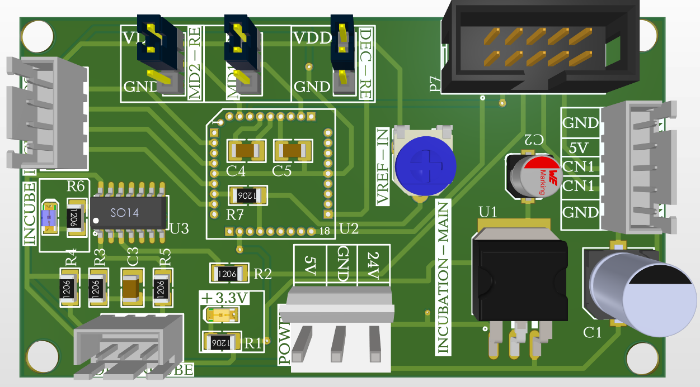
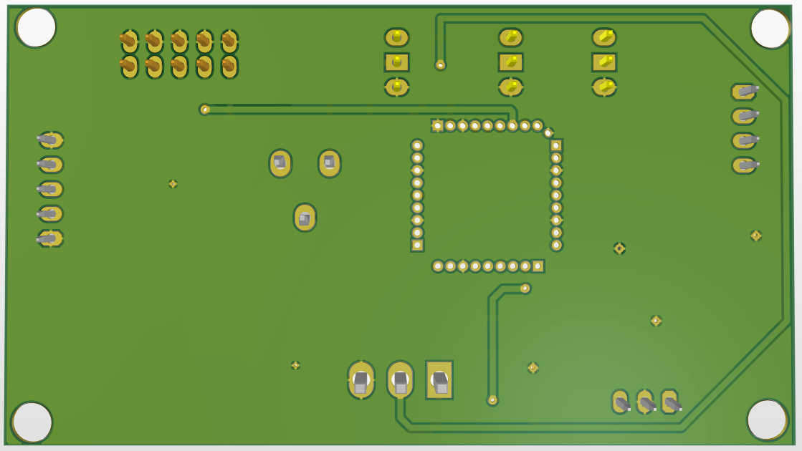
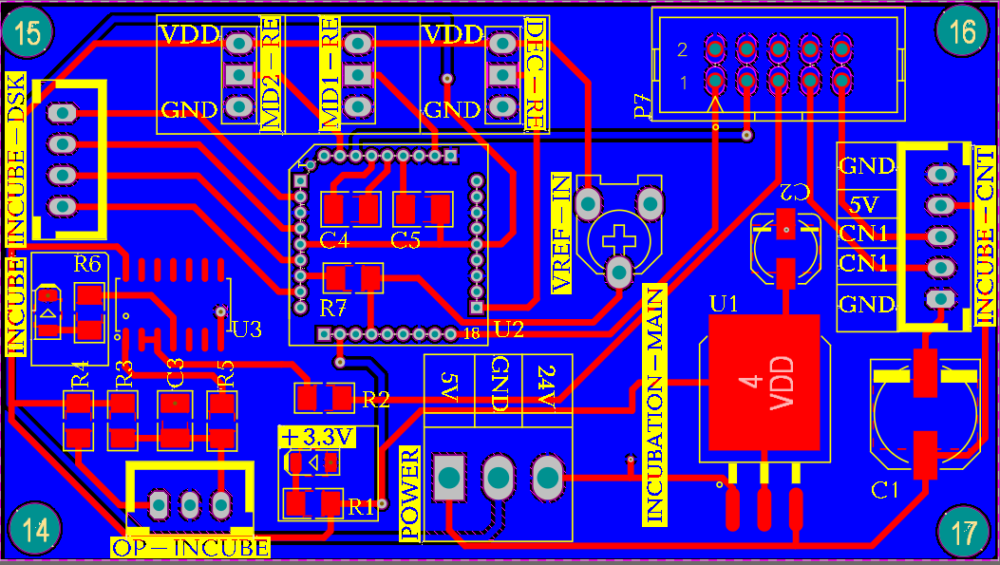

# Laboratory Incubator Controller Board

Altium Designer PCB layout, schematic, and Bill of Materials (BOM) for a specialized laboratory incubation control module, featuring multi-voltage power management, sensor interfacing, and configuration headers.

---

## 🛠 Features & Specifications

* **System Power Input:** 24V DC / 5V DC Main Power Terminal
* **Voltage Regulation:** On-board LDO regulator generating +3.3V supply
* **Control Core (U2):** DIP/DIP-Header module socket for microcontroller or driver carrier
* **Signal Conditioners:** 
  * Op-Amp / Analog Front-End (`U3` SO-14 IC) for precision sensor measurements
  * Multi-channel analog/digital signals via dedicated connectors
* **Configuration Jumpers:** Hardware micro-stepping / operating mode jumpers (`MD1-RE`, `MD2-RE`, `DEC-RE`)
* **Analog Adjustment:** Precision potentiometer (`VREF-IN`) for reference voltage tuning
* **Interface Connectors:**
  * `INCUBE-DSK`, `INCUBE-CNT`, `OP-INCUBE` expansion connectors
  * IDC Ribbon Header (`P7`) for main system communication

---

## 📁 Repository Structure

* `3d_top_view.png` — 3D PCB render (Top view)
* `3d_bottom_view.png` — 3D PCB render (Bottom view)
* `pcb_layout_top.png` — PCB Top Layer Copper and Silkscreen
* `pcb_layout_bottom.png` — PCB Bottom Layer Copper and Silkscreen
* `Incubation_Schematic.pdf` — Full Circuit Schematic Diagram
* `BOM_Incubation.xlsx` — Complete Bill of Materials (Component List)

---

## 🖼 Visuals

### 3D Model Render
| Top View | Bottom View |
| :---: | :---: |
|  |  |

### PCB Layout Design
| Top Layer | Bottom Layer |
| :---: | :---: |
|  |  |
